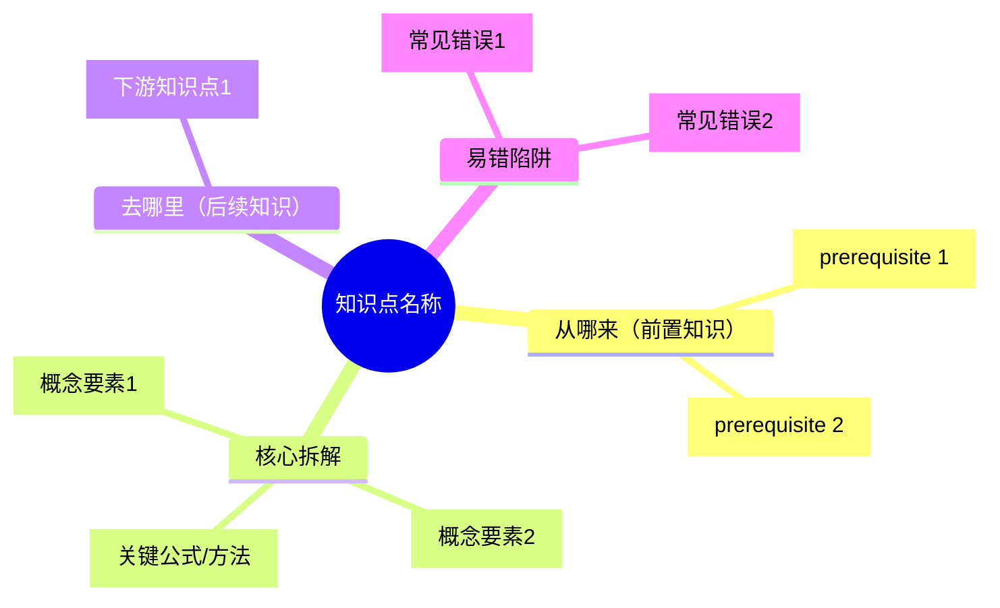

# 模式 3：learn（自学引导）

## 执行步骤

**Step 1 — 确定学习目标**

- 来自 diagnose 结果（本次对话补强路径）
- 用户指定（"我想学二次函数"）
- 用户指定章节

**Step 2 — 生成学习路径**

读取 dependencies.json，对目标知识点的所有前置依赖做拓扑排序，输出学习顺序：

```
📚 学习路径（共 N 个知识点）

1. [prerequisite name]（[type]，约30分钟）← 从这里开始
2. [prerequisite name]（[type]，约45分钟）
...
N. [目标 name]（[type]，约60分钟）← 目标
```

**Step 3 — 询问内容形式**

「你希望用哪种方式学习？」

- A. 思维导图（整体结构一目了然）
- B. 视频脚本（适合听觉学习，可照着讲给自己听）
- C. 故事化讲解（适合初学或觉得枯燥时）
- D. 费曼笔记（适合检验自己是否真懂）
- E. 刷题清单（边做边学）
- F. 全套（以上都要）

**Step 4 — 生成内容**

根据选择生成对应格式：

**思维导图（Mermaid）**



**视频脚本（3-5分钟）**

```
[开场 30s] 生活场景引入
  "你有没有遇到过...？今天我们来学..."

[核心 2-3min] 概念讲解
  "首先，[name] 的定义是..."
  "记住这个关键点：..."
  "我们来看一个例子：[assessmentPrompt 变体]"
  "解题步骤是：1... 2... 3..."

[收尾 30s] 总结+自测
  "记住口诀：..."
  "课后自测：[一道简单题]"
```

**故事化讲解**
将知识点包装进情境（购物/游戏/探险/体育），概念拟人化，用类比解释抽象定义，结尾给出"真实版"数学表达。

**费曼笔记**

```
【不用术语的一句话解释】
[用小学生能听懂的话描述这个知识点]

【生活类比】
[这个知识点就像...]

【类比在哪里会失效】
[类比的边界在于...]

【自检问题】
如果真理解了，能回答：[assessmentPrompt]
```

**刷题清单**
按难度递进出 5-8 题，每题后标注「答对继续」或「答错复习[知识点]」，形成自适应练习序列。
